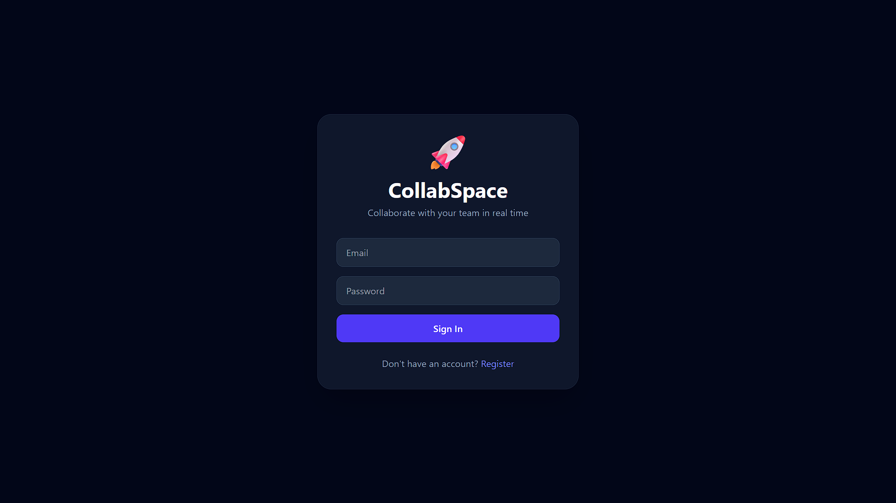
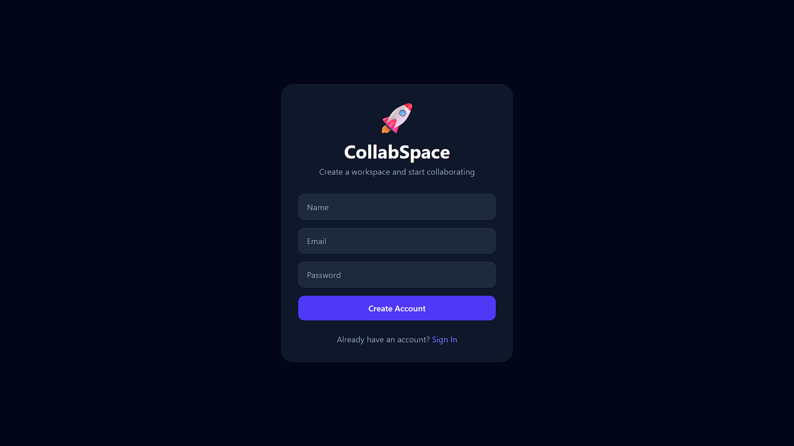
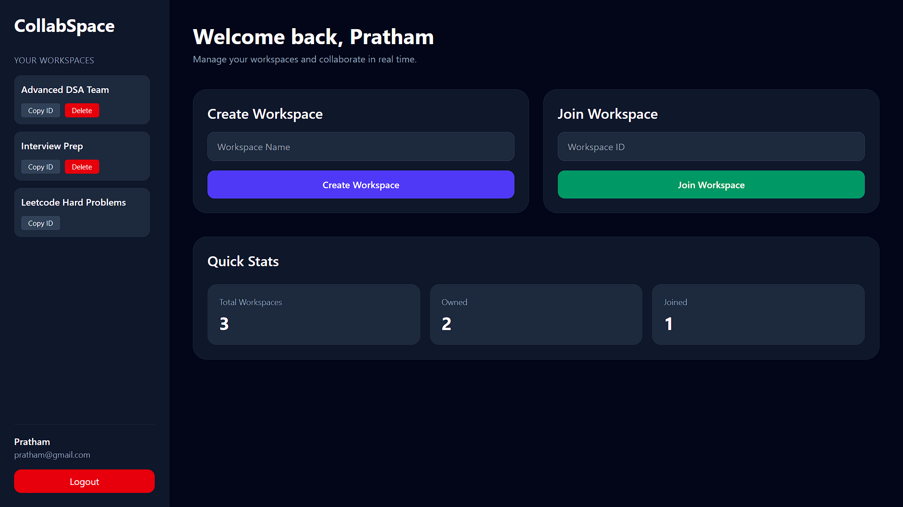
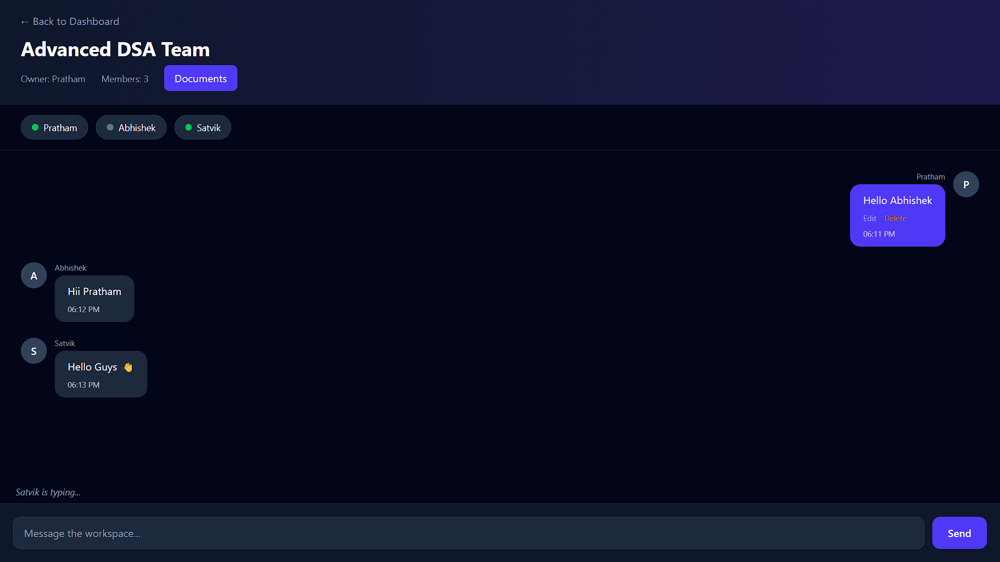
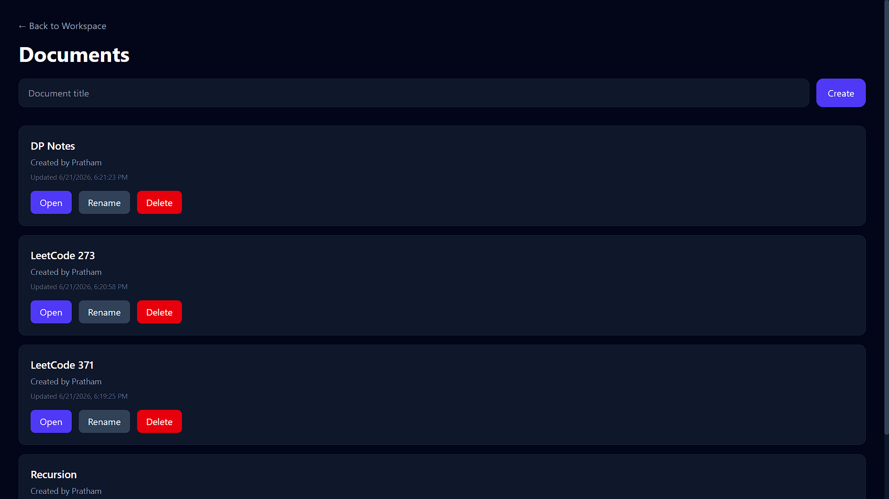
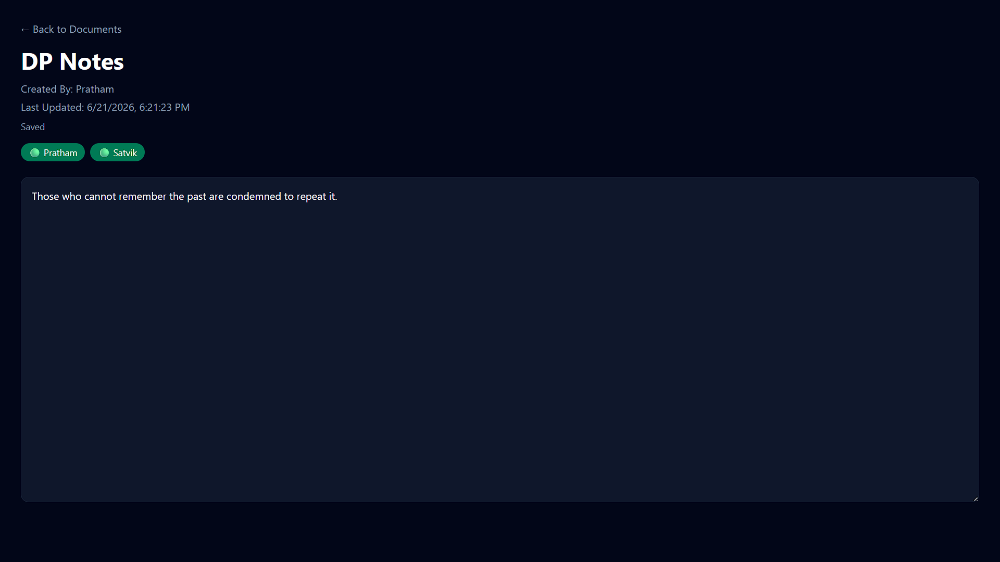

# 🚀 CollabSpace

A modern full-stack collaboration platform that enables teams to communicate, collaborate, and edit documents together in real time.

CollabSpace combines workspace management, real-time messaging, collaborative document editing, user presence tracking, and secure authentication into a single productivity platform.

Built using React, Node.js, Express, MongoDB Atlas, Socket.IO, and JWT Authentication.

---

## 🌐 Live Demo

### Frontend

https://collabspace-tau.vercel.app

### Backend API

https://collabspace-backend-yk8a.onrender.com

---

## ✨ Features

### Authentication

- User Registration
- User Login
- JWT Authentication
- Protected Routes

### Workspace Management

- Create Workspaces
- Join Workspaces using Workspace ID
- Delete Workspaces
- Real-time Member Count Updates
- Role-Based Access Control

### Real-Time Chat

- Instant Messaging
- Edit Messages
- Delete Messages
- Typing Indicators
- Auto Scroll to Latest Messages

### Collaborative Documents

- Create Documents
- Rename Documents
- Delete Documents
- Real-Time Collaborative Editing
- Auto Save Functionality
- Active Editors Tracking

### User Presence

- Online User Status
- Active Editors List
- Real-Time User Tracking

### User Experience

- Toast Notifications
- Loading Screens
- Confirmation Modals
- Responsive UI
- Modern Dark Theme

### Security

- JWT Authentication
- Protected API Routes
- Workspace Membership Validation
- Owner-only Workspace Management
- Owner-only Document Rename/Delete
- Authorization Checks on Sensitive Actions

---

## 🛠️ Tech Stack

### Frontend

- React
- Vite
- Tailwind CSS
- React Router DOM
- Axios
- Socket.IO Client
- React Hot Toast

### Backend

- Node.js
- Express.js
- MongoDB Atlas
- Mongoose
- JWT Authentication
- Socket.IO

### Deployment

- Vercel
- Render

---

## 🏗️ Architecture

```text
Frontend (React + Vite)
        │
        ▼
Backend API (Node.js + Express)
        │
        ▼
MongoDB Atlas

Realtime Communication

Frontend ↔ Socket.IO ↔ Backend
```

---

## 📸 Screenshots

### Login Page



### Register Page



### Dashboard



### Workspace Chat



### Documents



### Document Editor



---

## 📂 Project Structure

```text
collaboration-platform/
│
├── backend/
│   ├── src/
│   │   ├── config/
│   │   ├── controllers/
│   │   ├── middleware/
│   │   ├── models/
│   │   ├── routes/
│   │   ├── socket/
│   │   └── server.js
│
├── frontend/
│   ├── src/
│   │   ├── components/
│   │   ├── pages/
│   │   ├── services/
│   │   └── App.jsx
│
├── screenshots/
│
└── README.md
```

---

## ⚙️ Installation

### Clone Repository

```bash
git clone https://github.com/PrathamChaturvedi08/collaboration-platform.git

cd collaboration-platform
```

### Backend Setup

```bash
cd backend
npm install
```

Create `.env`

```env
PORT=5000
MONGO_URI=your_mongodb_connection_string
JWT_SECRET=your_secret_key
```

Start backend:

```bash
npm run dev
```

### Frontend Setup

```bash
cd frontend
npm install
```

Create `.env`

```env
VITE_API_URL=http://localhost:5000/api
VITE_SOCKET_URL=http://localhost:5000
```

Start frontend:

```bash
npm run dev
```

---

## 🔐 Environment Variables

### Backend

```env
PORT
MONGO_URI
JWT_SECRET
```

### Frontend

```env
VITE_API_URL
VITE_SOCKET_URL
```

---

## 🚀 Planned Enhancements

- AI Workspace Assistant
- AI Document Summarization
- Advanced Workspace Roles (Admin, Editor, Viewer)
- Workspace Invitations
- User Profiles and Avatars
- Rich Text Editor
- File Sharing
- Desktop Notifications
- Document Version History
- Search Functionality
- Email Verification
- Password Reset

---

## 👨‍💻 Author

Pratham Chaturvedi

GitHub:
https://github.com/PrathamChaturvedi08

---

## ⭐ Support

If you found this project useful, consider giving it a star on GitHub.
